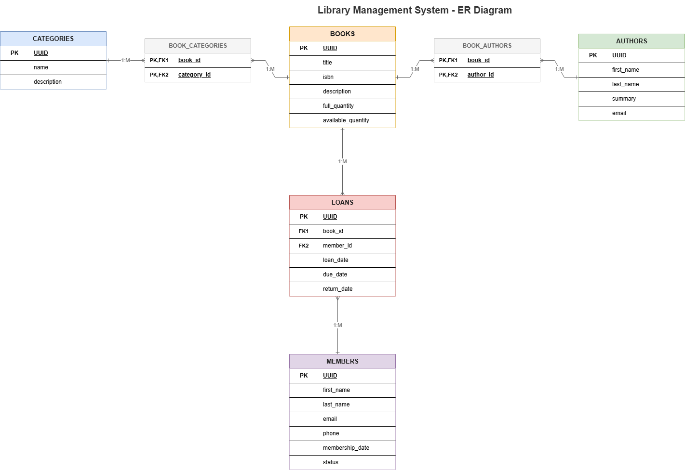

# Library Management System

This project is a robust **Java Backend** application developed to manage library resources, including books, authors, categories, and membership operations. It follows a clean architecture approach, ensuring scalability and maintainability.

---

## 🛠 Tech Stack
* **Language:** Java 21
* **Framework:** Spring Boot 3.3.3
* **ORM:** Spring Data JPA
* **Database:** PostgreSQL
* **Migration:** Liquibase
* **Documentation:** SpringDoc OpenAPI (Swagger)

---

## 🚀 About the Project
This system is designed to provide efficient CRUD (Create, Read, Update, Delete) operations for a library database. The database schema is version-controlled via **Liquibase**, ensuring consistent deployments across different environments.

---

## 📊 Database Schema
The Entity-Relationship (ER) diagram below illustrates the database architecture.



*   **View SVG Version:** [Download/View ER Diagram (SVG)](docs/library-management_db_er_diagram.svg)
*   **Edit Source File:** [Download .drawio Source](docs/library-management_db_er_diagram.drawio)

---

## ⚙️ Setup and Running

### Prerequisites
* JDK 21 installed.
* PostgreSQL database server running (Docker is recommended).

### Installation
1. Clone the repository:
   ```bash
   git clone <https://github.com/mahabbat-gozalov/library-management>
   cd library-management